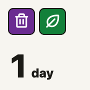
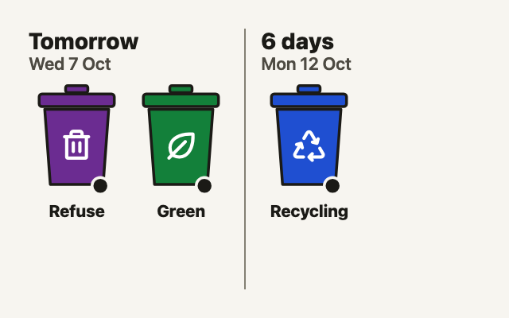
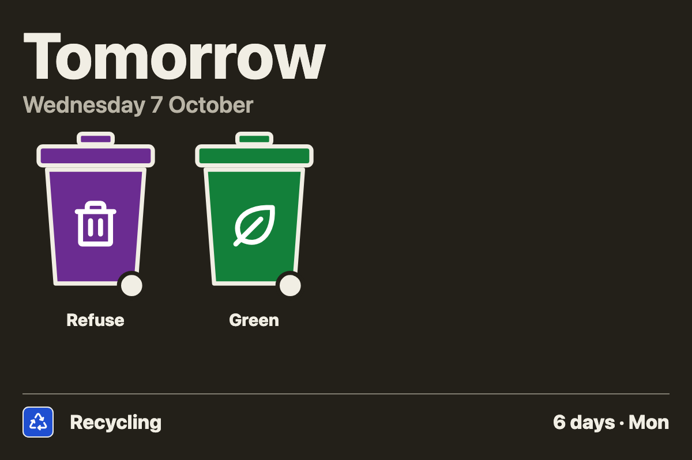
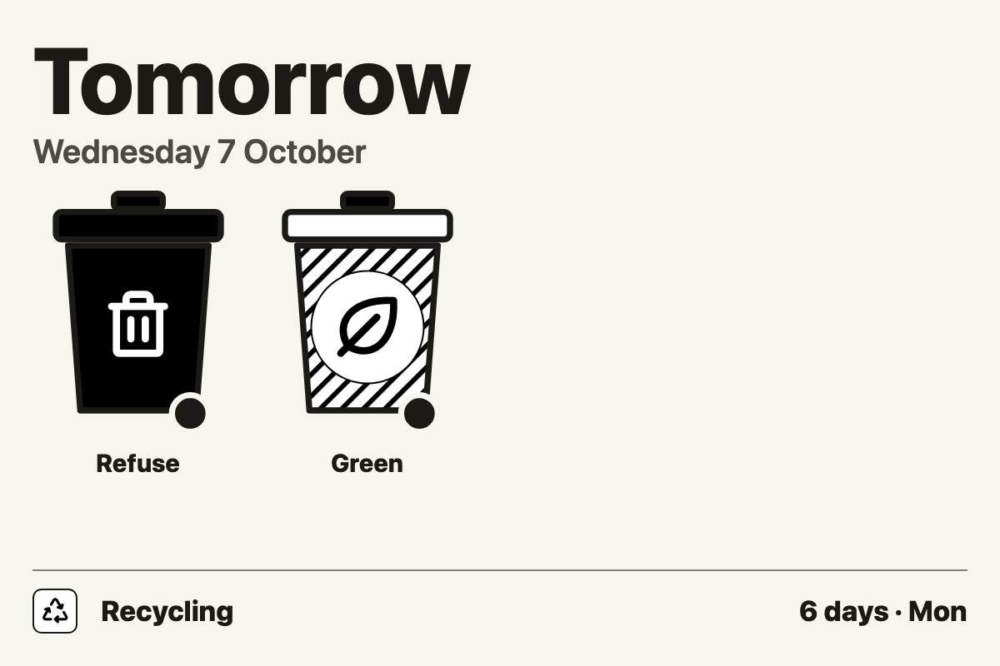

# Bin Day for Tesserae

A [Tesserae](https://github.com/dmellok/tesserae) widget that shows which bins
are collected in the next 7 days, and how many days until each collection.
The bins come from a Home Assistant calendar, such as the one
[Waste Collection Schedule](https://github.com/mampfes/hacs_waste_collection_schedule)
creates, or from a schedule you enter yourself.


It fits any cell size, from a single tile up to a full panel:

| XS | SM | MD |
| --- | --- | --- |
|  |  |  |

- Counts down to each collection ("Today", "Tomorrow", "6 days"), with the
  date on larger cells.
- Draws each bin in its real colours, lid included. Many councils give every
  bin the same body and tell them apart by lid, and Bin Day reads names like
  "Blue lid bin" too. See [Bin colours](docs/bin-colours.md).
- Picks an icon from the bin's name: refuse, recycling, garden, food, glass,
  paper. You can change any bin's name, icon and colours, or hide a bin you
  don't have.
- On collection day, the bins drop off at a time you choose (10:00 unless
  you change it) and the next collection shows.
- Colour for screens, exact inks for colour e-ink panels such as the Seeed
  reTerminal E1002, or black and white for mono panels.

## Examples

The Liverpool bins above in the dark theme, then in Black & white, and a
council that tells its bins apart by lid.

**Dark theme.** Outlines follow the theme, so dark bins stay clear on a dark
background.



**Black & white**, for mono panels and themes. Each bin gets a fill instead
of a colour: refuse solid, garden hatched, recycling white.



**Coloured lids.** Milton Keynes' bins all have the same body, with black,
blue and red lids. Bin Day reads the lid colours from names like "Blue lid
recycling", and each chip takes its bin's lid colour.


More schemes, and how to set each up: [Bin colours](docs/bin-colours.md).

## Install

In Tesserae, open the **Widgets** menu, choose **Browse catalog**, find **Bin
Day** and install it, then click **Restart required** at the top of the
page.

You get two widgets:

- **Bin Day**, the cell you place on a dashboard.
- **Bin Day Core**, where you set up your bins. It has a page of its own but
  no cell.

## Set up

Open Bin Day Core: **Widgets** menu, **Admin pages**, **Bin Day Core**. Choose
where your bins come from, then save.

### From a Home Assistant calendar

1. Connect Home Assistant, if you haven't already for another widget: in
   Tesserae, go to **Settings**, **Widgets**, **Home Assistant Core**, and
   enter your Home Assistant URL (such as `http://homeassistant.local:8123`)
   and a long-lived access token. To make a token in Home Assistant, open
   your profile, then the **Security** tab, then **Long-lived access tokens**.
2. In Bin Day Core, choose **Home Assistant calendar**, then your bins
   calendar.
3. Each bin in the calendar's next 8 weeks gets a row. Leave its icon and
   colours on Automatic, or set them. The eye button hides a bin from the
   widget. **Add a name** sets up a bin that hasn't appeared in the calendar
   yet. Each calendar keeps its own settings, so switching calendar loses
   nothing.

Bin Day checks the calendar at most once an hour. If Home Assistant can't be
reached, it keeps showing the last bins it had, for up to a day.

### From a schedule you enter

Choose **Manual schedule**, then **Add a bin** for each bin: its name, its
first collection date (any past collection date works too), and how often
it's collected (every 1 to 8 weeks). Bin Day works out the rest of the dates
from those.

### Place the widget

Add a **Bin Day** cell to a dashboard. It has two options:

| Option | What it does |
| --- | --- |
| Collection done by | After this time on collection day, that day's bins count as collected and the next collection shows instead. 10:00 unless you change it. |
| Colours | **Colour** suits screens. **Colour for e-ink** uses the exact inks of colour e-ink panels such as the reTerminal E1002, so bins print as solid ink. **Black & white** draws each bin solid, outlined or patterned, for mono panels. **Auto** uses Colour, or Black & white on black and white themes such as Paper and Newsprint. |

Every Bin Day cell shows the same bins, from Bin Day Core.

## Waste Collection Schedule

[Waste Collection Schedule](https://github.com/mampfes/hacs_waste_collection_schedule)
fetches collection dates from hundreds of councils and waste companies, and
creates a Home Assistant calendar for each source. Choose that calendar in
Bin Day Core. Bin Day needs every bin in the one calendar, so choose the
source's main calendar rather than one made with `use_dedicated_calendar`.

**Tip: name your bins in Waste Collection Schedule.** Its `alias` option
renames a waste type, and the new name is what its calendar events are
called, so it's also what Bin Day reads. A name that says what goes in the
bin, and its colour, needs no setting up in Bin Day Core. For Liverpool, whose
bins are called Refuse, Recycling and Green:

```yaml
waste_collection_schedule:
  sources:
    - name: liverpool_gov_uk
      args:
        uprn: "YOUR_UPRN"
      customize:
        - type: Refuse
          alias: Purple refuse bin  # the trash icon on a purple bin
        - type: Green
          alias: Garden waste       # the garden icon on a green bin
```

The same options are under **Customize** when you set Waste Collection
Schedule up in Home Assistant's UI. Aliases rename the bins everywhere in
Home Assistant. To change only how the widget shows them, use Bin Day Core
instead.

## Example: Liverpool

Waste Collection Schedule calls Liverpool's bins **Refuse**, **Recycling**
and **Green**. On its own, Bin Day reads these as a black refuse bin, a blue
recycling bin, and a green bin with no icon, since "Green" is only a colour.
Liverpool's refuse bins are purple, so in Bin Day Core:

| Bin name | Icon | Bin colour |
| --- | --- | --- |
| Refuse | Automatic | Purple |
| Recycling | Automatic | Automatic |
| Green | Garden | Automatic |

That gives the bins in the pictures above. If you don't have a garden waste
bin, hide **Green** with the eye button.

## Messages

| The cell says | What to do |
| --- | --- |
| Nothing this week | Nothing is collected in the next 7 days. |
| Add your bins in Bin Day Core | Add your bins, or choose a calendar, in Bin Day Core. |
| Choose your bin calendar in Bin Day Core | Bin Day Core is set to a Home Assistant calendar but none is chosen. |
| Needs Home Assistant Core | Connect Home Assistant (see [Set up](#from-a-home-assistant-calendar)). |
| Calendar ... wasn't found in Home Assistant | The calendar was renamed or removed. Choose it again in Bin Day Core. |
| Couldn't load ... from Home Assistant | Home Assistant can't be reached, and Bin Day has no bins from it in the last day. Check Home Assistant is running, and the URL and token in Home Assistant Core. |
| Fix your bins in Bin Day Core | A saved bin has a problem, named in the message. |
| Install the Bin Day Core plugin | Bin Day Core is missing. Install Bin Day again from the catalog; Bin Day Core comes with it. |

## Privacy

Bin Day only talks to your own Home Assistant, through Tesserae's Home
Assistant Core widget, and only when you use a calendar. It makes no other
network requests.

## Development

To run the tests, try changes in a local Tesserae, or render the
screenshots, see [Developing Bin Day](docs/development.md).

## Licence

MIT, see [LICENSE](LICENSE).
