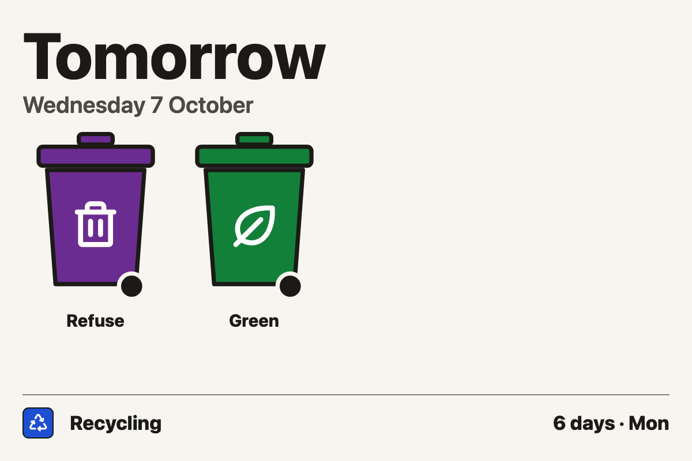
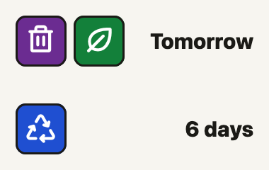
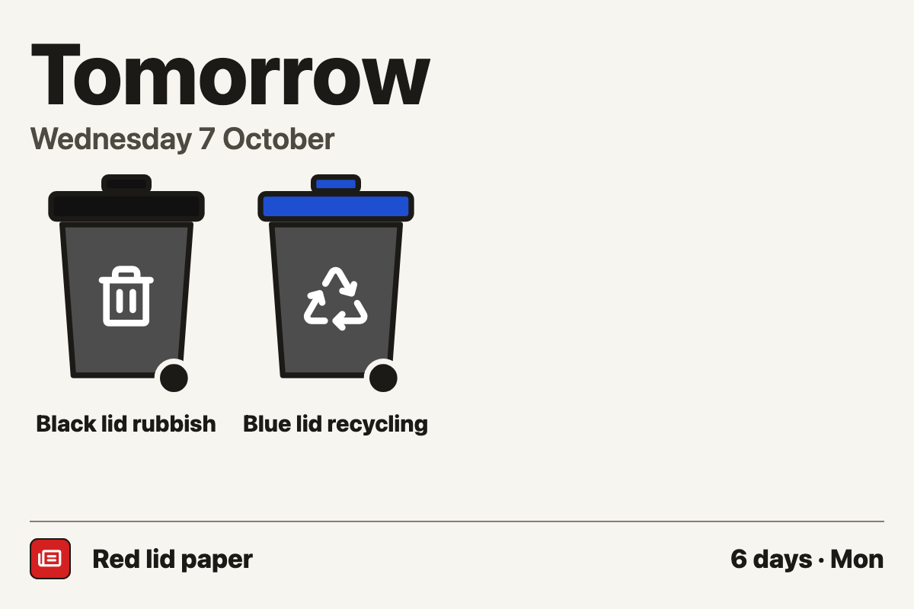
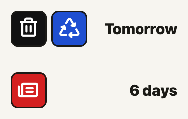
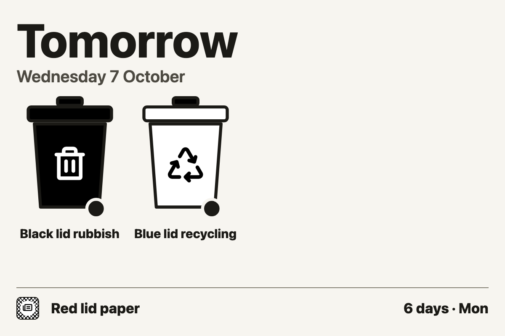
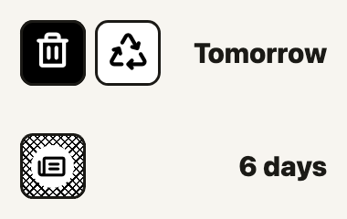
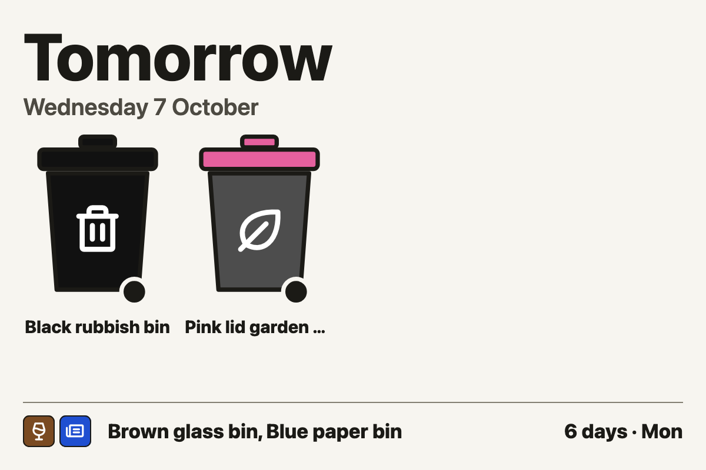
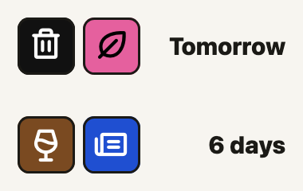
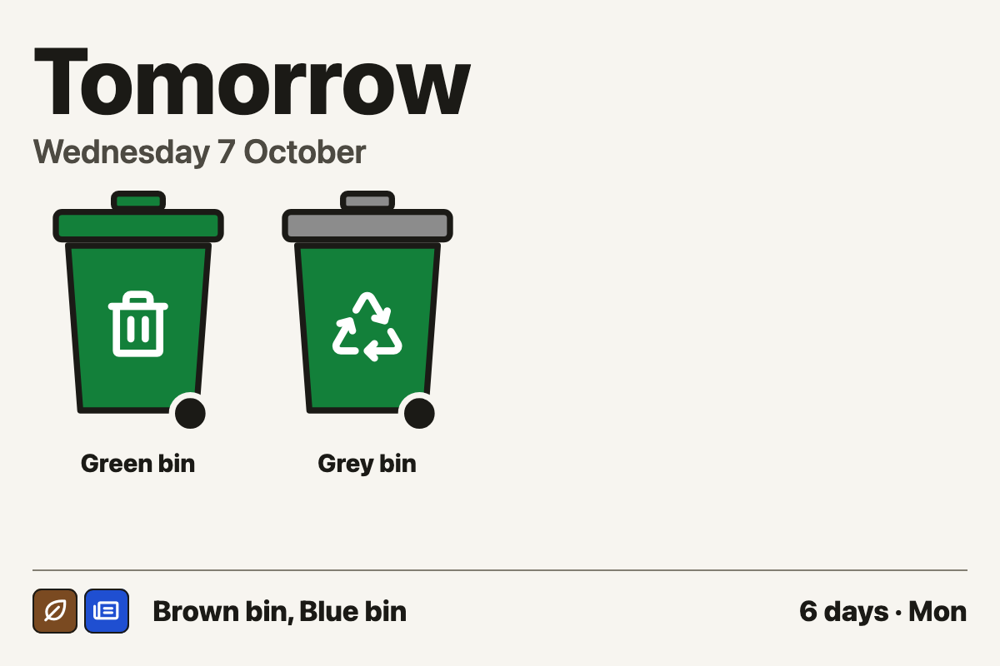
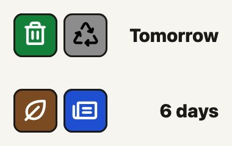

# Bin colours

Bin Day draws each bin as a wheelie bin with a **body colour** and a **lid
colour**. Smaller cells show each bin as a **chip**, a square with the bin's
icon. Councils colour their bins in a few different ways. This page shows
how each way looks on the widget and what, if anything, to set up in Bin Day
Core.

Images are LG and SM cells in the light theme; the clock is Tuesday 6
October 2026.

## How a bin gets its colours

Body and lid are worked out separately. For each, the first of these that
applies wins:

1. **Your setting in Bin Day Core.** Bin colour and Lid colour on the bin's
   row: a named colour, or Custom with a hex code.
2. **A colour in the bin's name.** "Blue lid", "blue lids" or "blue-lidded"
   colours only the lid. Any other colour word colours the body, and the lid
   too unless the name gives a lid colour. Phrases such as "green waste" are
   not read as colours.
3. **The material's usual colour:** refuse black, recycling blue, garden
   green, food light grey, glass light blue, paper white. A bin named by its
   lid colour gets a dark grey body instead.
4. Otherwise, grey.

So a bin's lid is its body colour unless something says otherwise. Some
names, and how they come out:

| Name | Body | Lid |
| --- | --- | --- |
| Blue bin | blue | blue |
| Recycling | blue | blue |
| Blue lid bin | dark grey | blue |
| Red-lidded bin | dark grey | red |
| Black bin with blue lid | black | blue |
| Recycling bin (brown, grey lid) | brown | grey |
| Garden waste - brown lid | dark grey | brown |
| Green waste | green | green |

**Chips take the lid colour.** Where every bin has the same body, the lid is
what tells them apart, and it is the colour people name them by ("the
blue-lidded bin"). For a one-colour bin the lid is the body colour, so its
chip matches it either way.

**Black & white** (the Colours option, or a black-and-white theme) gives each
bin a fill instead of a colour: refuse solid, garden hatched, recycling
white, and every other bin a fill from its lid colour. A recycling bin and a
bin with a light lid (white, light grey, blue, light blue or yellow) both
come out white; their icons still tell them apart.

## One colour per bin

Liverpool, Bolton, Rochdale and Angus, among others: each bin is one colour,
lid included. Liverpool's are purple (refuse), blue (recycling) and green
(garden).

| LG | SM |
| --- | --- |
|  |  |

**Set up:** usually nothing. Where a name has no colour in it, set the Bin
colour: here, Refuse is set to Purple, because refuse is otherwise black.
Liverpool's calendar calls its garden bin just "Green", which reads as the
colour, so its icon is set to Garden.

## Same body, coloured lids

Milton Keynes, Southend, Dacorum, Birmingham, and Elmbridge, Mole Valley,
Surrey Heath and Woking, among others: every bin has the same black or dark
grey body, and the lids differ. Most councils changing their bins recently
have chosen this. Milton Keynes' lids are black (rubbish), blue (plastic,
metal and glass) and red (paper and card).

| LG | SM |
| --- | --- |
|  |  |

In Black & white, each lid colour gets its own fill:

| LG | SM |
| --- | --- |
|  |  |

**Set up:** nothing, if your calendar's names include the lid colour ("Red
lid paper"). Otherwise set each bin's Lid colour, and its Bin colour to Black
or Dark grey; left on Automatic, the body would take the material's colour.

## Mixed schemes

Salford, Rochdale and Nottingham, among others: mostly one-colour bins, plus
one or two told apart by lid. Salford's garden and food bin is black with a
pink lid; Rochdale's mixed recycling bin is light green with a blue lid;
Nottingham's recycling bin is brown with a grey lid.

| LG | SM |
| --- | --- |
|  |  |

**Set up:** set the Lid colour on the lid-coded bin, or let its name supply
it. Here the name "Pink lid garden bin" gives a dark grey body; set its Bin
colour to Black to match Salford's exactly. Rochdale has two blue lids: their
chips are both blue but carry different icons. To tell them apart by colour
as well, give one of them a different lid colour.

## Bins named by their lid, with coloured bodies

Perth & Kinross: every bin is green, and the lids are green, grey, blue and
brown. The council calls them the green, grey, blue and brown bins after
their lids, so "Grey bin" there means a green bin with a grey lid. Read
literally, that name would give a grey bin.

| LG | SM |
| --- | --- |
|  |  |

**Set up:** set each bin's Bin colour to Green and its Lid colour to the
colour in its name. Names like these say nothing about what goes in the bin,
so set each one's icon too.

## Colours to choose from

Black, Dark grey, Grey, Light grey, Blue, Light blue, Green, Brown, Purple,
Pink, Maroon, Burgundy, Red, Yellow, Orange and White, or Custom with any hex
code (Bolton's beige bins, for example).

With Colours set to Colour for e-ink, black, white, blue, green, red, yellow
and orange use the panel's own inks exactly. Other colours, dark grey and
pink among them, are dithered from those inks, so they print speckled.

## Sources

From each council's own website, as of October 2026. Councils change their
bins, so check yours.

- Milton Keynes: [which bin is which](https://www.milton-keynes.gov.uk/waste-and-recycling/waste-collection-milton-keynes/frequently-asked-questions)
- Southend: [collections from October 2025](https://www.southend.gov.uk/recycling-waste-0/recycling-waste-collections-october-2025/9)
- Dacorum: [blue-lidded wheeled bin](https://www.dacorum.gov.uk/home/environment-street-care/recycling-refuse-waste/household-waste-recycling/blue-lidded-wheeled-bin)
- Birmingham: [your recycling and rubbish bins](https://www.birmingham.gov.uk/info/20009/waste_and_recycling/105/about_your_recycling_and_rubbish_bins)
- Elmbridge, Mole Valley, Surrey Heath and Woking: [which bin is which](https://www.jointwastesolutions.org/bin-collections/your-bins/which-bin-is-which/which-bin-is-which-elmbridge/)
- Perth & Kinross: [waste and recycling bin policy](https://www.pkc.gov.uk/media/13760/Waste-and-Recycling-Bin-Policy/pdf/Waste_Recycling_Bin_Policy_2023_PDF.pdf)
- Salford: [recycling bins](https://www.salford.gov.uk/bins-and-recycling/recycling-bins-and-advice)
- Rochdale: [what goes in each bin](https://www.rochdale.gov.uk/bins-recycling/goes-bin)
- Nottingham: [household waste](https://www.nottinghamcity.gov.uk/information-for-residents/bin-and-rubbish-collections/household-waste/)
- Liverpool: [what goes in my bins](https://liverpool.gov.uk/bins-and-recycling/what-goes-in-my-bins/)
- Bolton: [rubbish and recycling](https://www.bolton.gov.uk/rubbish-recycling)
- Greater Manchester: [bin colours by council](https://recycleforgreatermanchester.com/wp-content/uploads/2025/11/Bin-Colours-Information-sheet.pdf)

## Updating the images

The images are screenshot scenarios from `preview/scenarios.py`, each
rendered at the sizes in its `docs` field. To render them again after a
change to the widget:

```sh
uv run preview/shoot.py --docs
```
